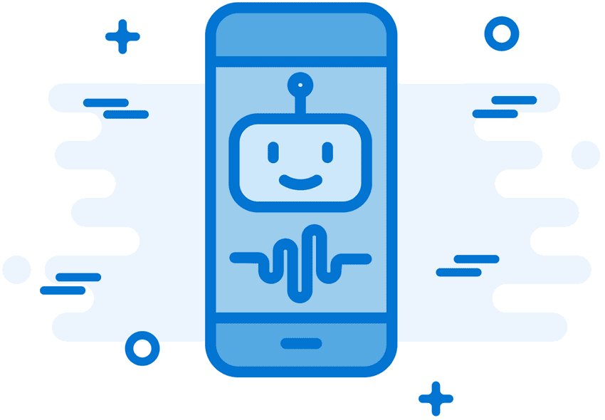

<!-- 1.0.1 -->
## Впервые на этом курсе 
### Впервые в этом курсе
Знаете ли вы, что фермеры могут устанавливать датчики на свои посевы, которые говорят им, когда нужно поливать, сколько воды необходимо, и когда их собирать? Благодаря этой информации фермеры могут получить лучшее качество и количество урожая. Угольные шахтеры могут устанавливать датчики в шахту, которые способны обнаружить небольшое количество опасных газов. Эта информация спасает жизни. Автомобильные страховые компании могут предлагать водителям более низкие тарифы в обмен на доступ к их данным о передвижении. Это обеспечивает более справедливое и точное ценообразование и увеличивает прибыль при одновременном сокращении затрат.

IoT - это данные. IoT - это оцифровка аспектов нашей жизни, наших предприятий и наших государственных структур, чтобы предоставить реальные сведения о том, как можно спасать жизни, повышать производительность и улучшить жизнь населения. Может быть тебе захочется карьеру в IoT.

Курс "Введение в Интернет вещей" (I2IoT) объясняет, что такое IoT, что он делает, как он является частью цифровой трансформации, и как можно сделать свой вклад в него. Вы узнаете об экспоненциальном увеличении количества интеллектуальных устройств, подключенных к Интернету, и научитесь программировать одно из этих интеллектуальных устройств. Курс объясняет искусственный интеллект и влияние автоматизации на наше будущее. Наконец, вы поймете, что все более важное значение имеет конфиденциальность и безопасность.

Цель этого курса - объяснить Интернет вещей и цифровые технологии, и показать, как эти два фактора сейчас являются частью более широкой категории, называемой цифровым преобразованием.

После прохождения этого курса Вы сможете сделать следующее:

* Объяснить значение и влияние цифровой трансформации.
* Применить базовое программирование для поддержки устройств IoT.
* Объяснить, как данные обеспечивают ценность для цифрового бизнеса и общества.
* Объяснить преимущества автоматизации в оцифрованном мире.
* Объяснить необходимость повышения безопасности в оцифрованном мире.
* Открыть для себя возможности, предоставляемые цифровым преобразованием.
 
<!-- **ВНИМАНИЕ**: Скорее всего эта часть не нужна -->

### Доступные ресурсы
*Ответы на часто задаваемые вопросы можно найти по адресу https://skillsforall.com/help или на верхней навигационной панели, нажав кнопку "Справка". Для получения справки по загрузке Packet Tracer посетите веб-сайт https://skillsforall.com/resources/lab-downloads и прокрутите страницу Learning Resources. Вы можете найти дополнительные вопросы, посетив нашего виртуального помощника Моргана. Щелкните значок чата в правом верхнем углу, чтобы выбрать из списка тем или ввести вопрос. Помощь Моргана включает в себя информацию о Packet Tracer, сертификатах и эмблеме.*
<!-- **ВНИМАНИЕ**: Скорее всего эта часть не нужна -->

<!-- 1.0.2 -->
## Iota - почему мне стоит пройти этот курс?

Здравствуйте! Добро пожаловать в Интернет вещей! Я Йота, и я буду Вашим проводником. Что вы думаете об этом видео? Есть ли у Вас какая-либо из этих технологий в Вашем доме или на машине? Это смартфон в твоей руке? Тогда могу поспорить, что большая часть интернета вещей, или как мы любим называть его IoT, уже знакомы Вам. Используете ли Вы смартфон, чтобы оставаться на связи с семьей и друзьями? Если это так, то ваш смартфон является центром вашей собственной сети, а ваша сеть является частью IoT. Но IoT гораздо больше! Готовы? Вперед!

<!-- 1.0.3 -->
## Видео 1.0.3 - Замкнутая история

В этом видео Вы увидете пример того, как Интернет вещей может упростить жизнь для семьи.

<!-- здесь ссылка на видео -->

<!-- 1.0.4 -->
## Iota - Почему следует взять этот модуль?

Это видео рассказывает веселую историю о будущем, где все взаимосвязано. И это будущее не за горами! Уже есть холодильники, которые могут сказать вашему подключенному устройству, что запас молока заканчивается. И умные дома, где вы можете сказать своей домашней системе приготовить кофе. У нас даже есть беспилотные автомобили!
Связи — это то, как мы создаем сети. Но что мы на самом деле подразумеваем под "сетями"? Если Вы поддерживаете связи в Интернете, Вы знаете свою социальную сеть там. Электросеть в вашем городе или поселке — это тоже сеть. Осиновая роща на самом деле представляет собой сеть из множества деревьев, имеющих общую корневую систему. Существуют сети в природе и сети, созданные человеком. Интернет — это сеть сетей, и некоторые из этих сетей состоят из многих вещей. Эти сети и есть то, что мы называем IoT.

<!-- 1.0.5 -->
## Что я буду изучать в этом модуле?

**Название модуля:** Всё взаимосвязано 

**Цель модуля:** Объяснить значение и влияние цифровой трансформации.

| Название темы | Цель темы |
|---- | ------------ |
| Цифровизация преобразует бизнес | Объяснить, как цифровые преобразования влияют на бизнес, промышленность и нашу повседневную жизнь. |
| Сети связывают весь мир | Объяснить, как сети обеспечивают платформу для цифрового бизнеса и общества. |
| Рост количества устройств IoT | Описать экспоненциальный рост устройств IoT. |
| Подключение устройств IoT к сети | Настроить устройства для связи в IoT. |
