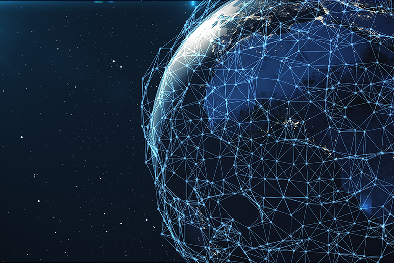
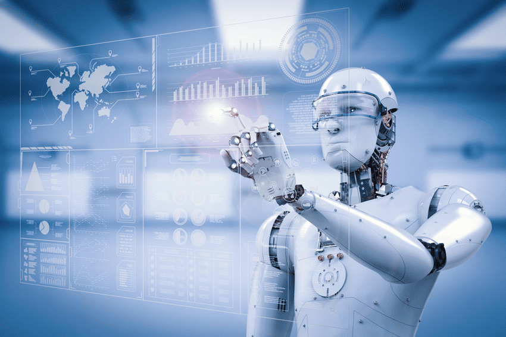
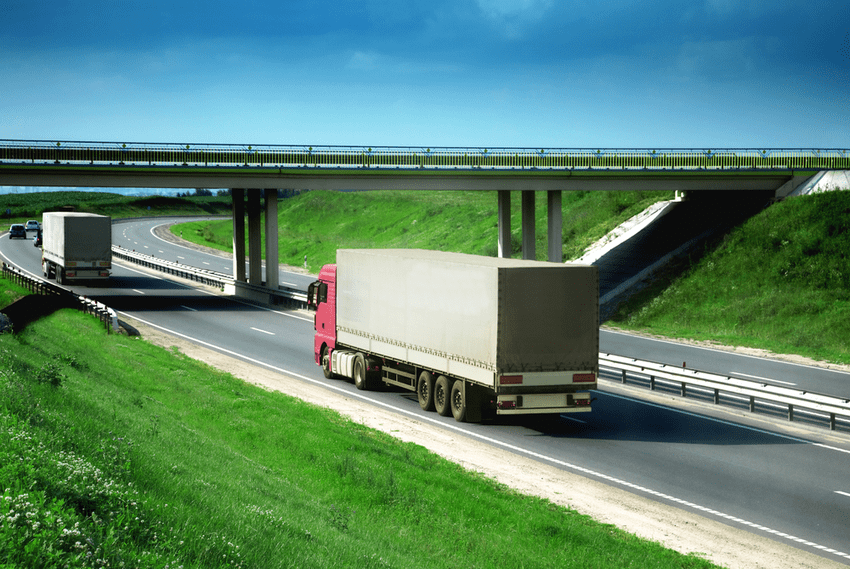
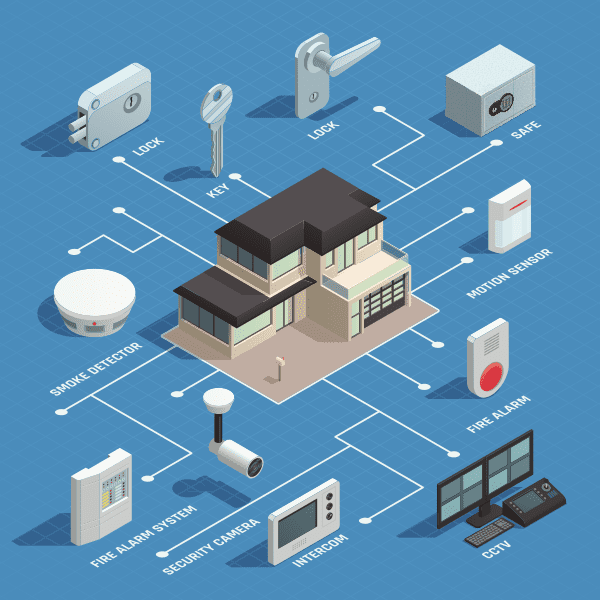
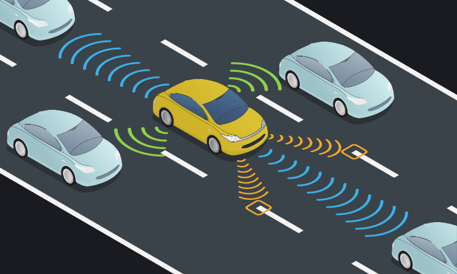

# Переводим Циску
Цифровизация трансформирует бизнес
## 1.1.1 Эволюция цифровой трансформации

Скажите правду .... сколько из вас на самом деле может прожить день без смартфона?

В современном мире умных устройств больше, чем людей. Все большее число людей так или иначе подключены к Интернету, причем 24 часа в сутки. Все больше людей используют и полагаются на три, четыре или более умных устройства. К ним могут относиться смартфоны, мониторы физических упражнений и состояния здоровья, электронные книги и планшеты. Согласно прогнозам, на каждого человека на земле в среднем будет приходиться 3,4 умных устройства или соединения.

Интернет вещей (IoT) актуален для многих отраслей. Системы IoT вносят вклад в контроль окружающей среды, розничную торговлю, транспорт, здравоохранение и сельское хозяйство, и во многие другие отрасли. По данным Statista, число IoT-устройств, используемых во всех соответствующих отраслях, согласно прогнозам, вырастет до более чем восьми миллиардов к 2030 году. Что касается потребителей, то важными направлениями роста являются интернет и цифровые медиа устройства, в том числе смартфоны. По прогнозам, к 2030 году это направление ожидает рост до более чем восьми миллиардов устройств. Другими сферами применения, с более чем миллионом подключенных устройств, являются подключенные и автономные транспортные средства, ИТ-инфраструктура, управление активами и интеллектуальные электросети.

Как могут столько устройств быть связаны друг с другом?

Современные цифровые сети делают все это возможным. Мир быстро покрывается сетями, которые позволяют цифровым устройствам соединяться и передавать данные. Подумайте о сети как о цифровой коже, окружающей планету. При помощи этой цифровой кожи могут соединяться мобильные устройства, электронные датчики, электронные измерительные устройства, медицинские устройства, и счетчики. Они отслеживают, передают, оценивают и в некоторых случаях автоматически подстраиваются под собираемые и передаваемые данные.

По мере того, как общество учится использовать эти цифровые устройства, цифровые сети продолжают расти во всем мире, а экономические выгоды от цифровизации продолжают расти, мы наблюдаем цифровую трансформацию. Цифровая трансформация — это применение цифровых технологий для создания условий для инноваций в бизнесе и промышленности. Эта цифровая инновация теперь применяется ко всем аспектам человеческого общества

## 1.1.2 Практическое задание - Насколько мы все связаны?

Важно понимать, что большинство людей, родившихся после 1990-х годов, выросли преимущественно в цифровом мире. Этот опрос поможет вам узнать, сколько времени в действительности вы проводите «на связи». Это поможет нам увидеть влияние этого поколения на бизнес и экономику.

(ссылка на задание) [нужны навыки использования json]

## 1.1.3 Влияние цифровой трансформации на бизнес

/b/ Автоматизация умного дома /b/

Цифровые технологии позволяют бизнесу внедрять инновационные подходы к взаимодействию с обществом. Люди всех поколений более комфортно относятся к цифровым технологиям и используют "умные" устройства с пользой пока заняты делами в течении дня.

/b/ Умные здания /b/

В настоящее время многие компании предоставляют некоторые или все свои услуги в режиме онлайн. Находясь в удобном месте - в автомобиле, тренажерном зале или офисе - Вы можете совершать покупки в режиме он-лайн, заказывать ресторанные блюда, которые доставляются к Вам на дом, бронировать туры в режиме он-лайн, заказывать одежду, туристические снаряжения, такси, оставаться на связи с друзьями или встретить новую любовь.

Датчики находятся повсюду и генерируют огромное количество данных.

Умные дома могут быть оснащены датчиками движения, воды, света, звонка в дверь, и температуры. Датчики могут быть в светофорах, грузовиках, гаражах, камерах безопасности, поездах и самолетах. Все эти датчики и измерительные устройства собирают и передают свои данные. Данные могут быть сохранены и проанализированы позднее или могут быть проанализированы сразу же, чтобы с их помощью корректировать работу компьютеров, мобильных устройств или процессов любого рода.

Как используются хранимые и анализируемые данные?
Предприятия определяют покупательские модели, прогнозируют новые тенденции и оптимизируют производство.
Правительства следят за состоянием окружающей среды, прогнозируют демографические тенденции, прогнозируют уровни преступности и планируют социальное обеспечение.
Города контролируют дорожное движение, следят за парковкой, обеспечивают более оперативную поддержку полиции или пожарной охраны и контролируют утилизацию отходов.

(2 вопроса с вариантами ответов, опять нужен json)

## 1.1.4 Могут ли умные устройства думать?

Все цифровые устройства работают на базе компьютерных программ и предоставленных данных. Искусственный интеллект подразумевает, что эти устройства способны думать самостоятельно. Умные устройства могут оценивать предоставляемые им данные и изменять процессы или настройки "на лету", если запрограммированы соответствующим образом. Если они получают достаточно данных, они могут "учиться" и изменять свой собственный код на основе новых параметров

Представьте себе транспортный грузовик с рефрижераторной установкой, перевозящий замороженные товары, который оснащен датчиком глобального позиционирования. Когда грузовик въезжает в большой город, датчик определяет, что впереди авария, вызвавшая серьезную пробку. Датчик отправляет данные в компьютерную систему, которая собирает данные и принимает решения. Затем система оповещает водителя о новых условиях, которые позволяют объехать место аварии. Это автоматическое взаимодействие экономит время водителя и ускоряет доставку замороженной продукции на рынок.

В офисах компании могут работать тысячи сотрудников. Поддержание условий для работы в здании, таких как освещение, тепло, влажность, в пределах приемлемых параметров помогает сотрудникам оставаться в хорошем настроении, и, следовательно, быть более продуктивными.

Умные города, такие как Барселона в Испании, используют датчики для управления многими инфраструктурными системами, такими как транспортные потоки, парковка, использование воды и гидроэнергия.

Пример 1: Датчики веса на парковочном месте позволяют водителям быстро определить место для парковки. Это сокращает время движения и холостого хода для водителя и снижает выбросы углекислого газа в окружающую среду.

Пример 2. Датчики на светофорах могут определять перегрузку дорожного движения. Эти данные отправляются в компьютерную систему, которая собирает данные и принимает решения. Новые решения отправляются на приводы, которые изменяют время красного и зеленого света, чтобы помочь в регулировании потока транспорта. Кроме того, снижается уровень холостого хода, а также снижается уровень недовольства водителей и количество аварий.

Самоуправляемые автомобили революционизируют транспорт. Автомобили оснащены множеством ультразвуковых датчиков, камер, точных GPS устройств и компьютеров. Сочетание бортового оборудования позволяет компьютерам определять другие автомобили, полосы движения, пешеходов и препятствия. Эта информация позволяет машине оставаться в своей полосе движения, останавливаться при необходимости и маневрировать вокруг препятствий.

Некоторыми из производителей на рынке "автономных автомобилей" являются Tesla Motors, General Motors, Volvo и Mercedes-Benz. Такие корпорации, как Waymo, Google и Uber также разрабатывают и тестируют технологию.

Путь к полной автономии с использованием этой технологии является сложным. Было много громких аварий и несколько серьезных столкновений с участием самоуправляемых автомобилей. Некоторые штаты в США уже одобрили ограниченное использование самоуправляемых автомобилей, но исследователи считают, что пройдет несколько лет, прежде чем технология станет массовой.

Как только технология будет проверена, что дальше? Самоуправляемые грузовики? Самолеты? Поезда?

## 1.1.5 Видео - Идеальные здания
Это компонент проигрывателя мультимедиа. Нажмите кнопку воспроизведения/паузы для просмотра или прослушивания.

Нажмите кнопку Воспроизвести в видео, чтобы узнать больше об идеальных зданиях.

(ссылка на видео) 
[его надо вытащить из платформы, так как там используется Brightcove Player]

## 1.1.6 Проверка понимания - Цифровизация трансформирует бизнес
Проверьте свое понимание того, как цифровизация трансформирует бизнес, выбрав правильный ответ на следующие вопросы.

(6 вопросов с радио-кнопкой) 
